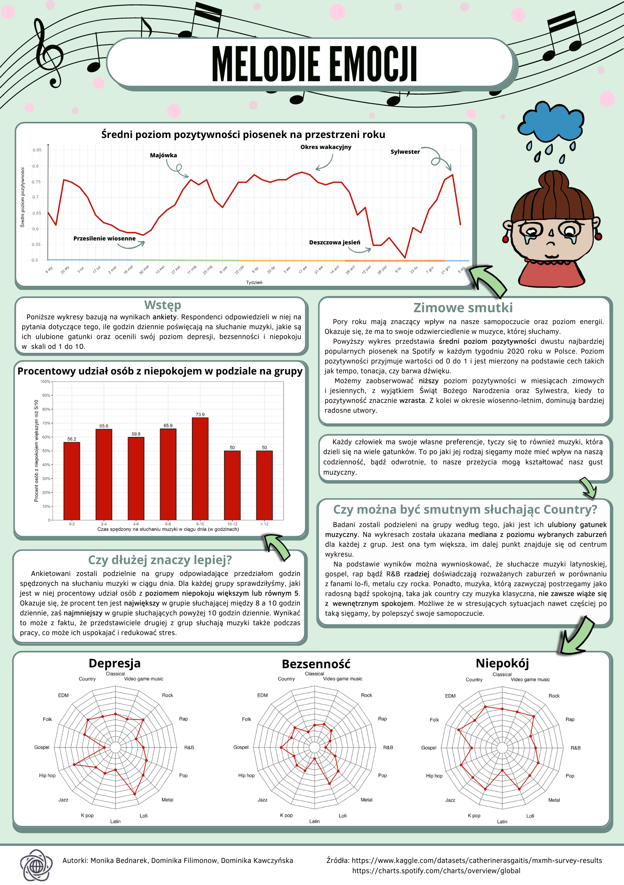
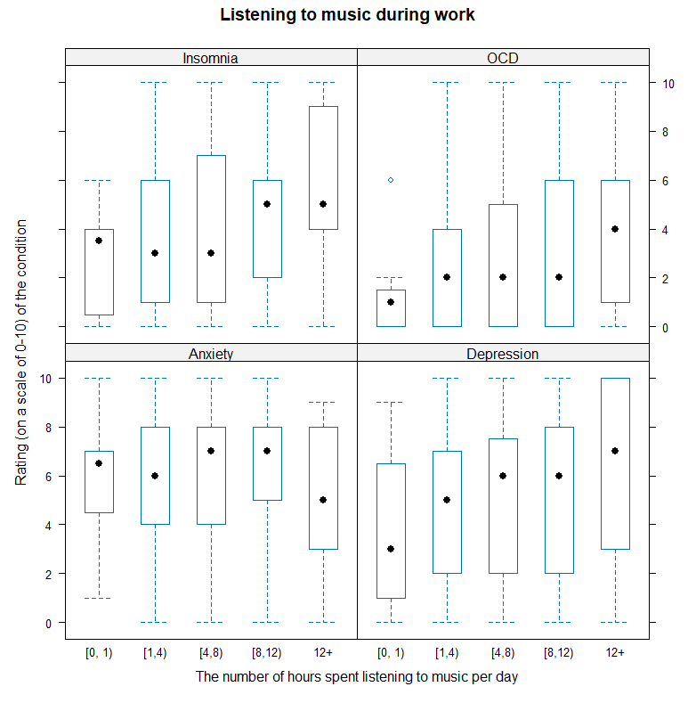
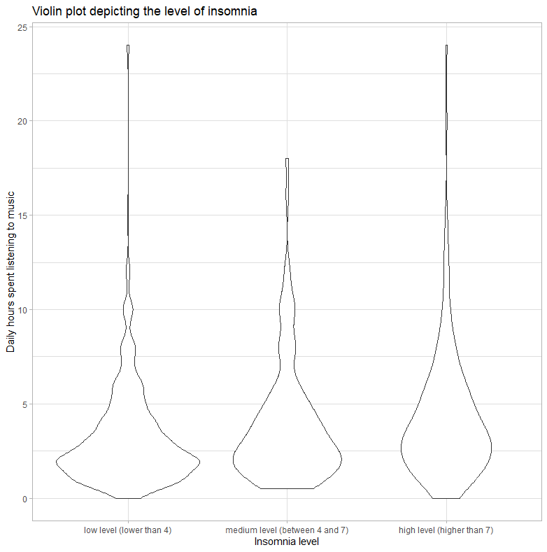
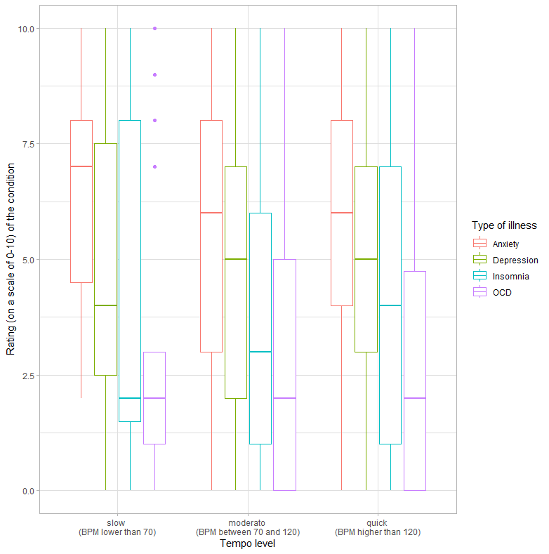

# Melodies of emotions
<div style="text-align: justify">
Visualization of the interaction between music and mental health. The poster (in the Polish language version below) illustrates the relationship between the average level of positivity of songs listened to by respondents and the season, emphasizing the importance of the influence of surrounding sounds on well-being and ailments such as insomnia. Additionally, it includes brief conclusions from the obtained visualizations.
</div>



## Inspiration

<div style="text-align: justify">
The poster was a student project that we worked on in small groups as part of a data visualization course. The main theme was music. My group created several charts (the ones I personally contributed to are in the file: generating_charts.R) to select the most interesting ones for the poster.
</div>

## Data
The data used in the project: <br>
- [Survey results on music taste and self-reported mental health](https://www.kaggle.com/datasets/catherinerasgaitis/mxmh-survey-results) <br>
- [https://charts.spotify.com/charts/overview/global](https://charts.spotify.com/charts/overview/global)

## Technologies
<div style="text-align: justify">
All charts were created in RStudio using the R language version 4.2.2. Libraries such as ggplot2, dplyr, fmsb, lattice etc,  were used. Additionally, the Canva program was used to create the poster itself.
</div>

## Sample charts that were not used

<div style="text-align: justify">
A box plot was created to describe the relationship between listening to music during work, the number of hours spent listening to music during the day, and the rating of anxiety, depression, insomnia, and obsessive-compulsive disorder levels by the respondents. 
</div>


A violin plot was created to depict the level of insomnia based on the daily hours spent listening to music.

## How to run the script?
The generating_charts.R script should be executed in RStudio. An example of running the code to generate a plot and display it:

```{r}
# A box plot describing the relationship between the tempo of the listened music
# and the rating of anxiety, depression, insomnia, and OCD levels by the respondents
boxplot_tempo <- {
  mxmh %>% 
  filter(!is.na(BPM)) %>% 
  mutate(tempo = case_when( BPM <= 70 ~ "slow \n(BPM lower than 70)",
                             BPM > 70 & BPM <= 120 ~ "moderato \n(BPM between 70 and 120)",
                             BPM > 120 ~ "quick \n(BPM higher than 120)"),
         tempo = factor(tempo, levels = c("slow \n(BPM lower than 70)",
                                          "moderato \n(BPM between 70 and 120)",
                                          "quick \n(BPM higher than 120)"))) %>%
  select(tempo, Anxiety, Depression, Insomnia, OCD) %>%
  melt(id.vars = "tempo", 
       measure.vars = c("Anxiety", "Depression", "Insomnia", "OCD")) %>%
  ggplot(aes(x = tempo, y = value, color = variable)) + 
  geom_boxplot() +
  labs(x = "Tempo level",
       y = "Rating (on a scale of 0-10) of the condition",
       color = "Type of illness") +
  theme_light()
}
```
Displaying the plot
```{r, out.width="100%"}
boxplot_tempo 

```
